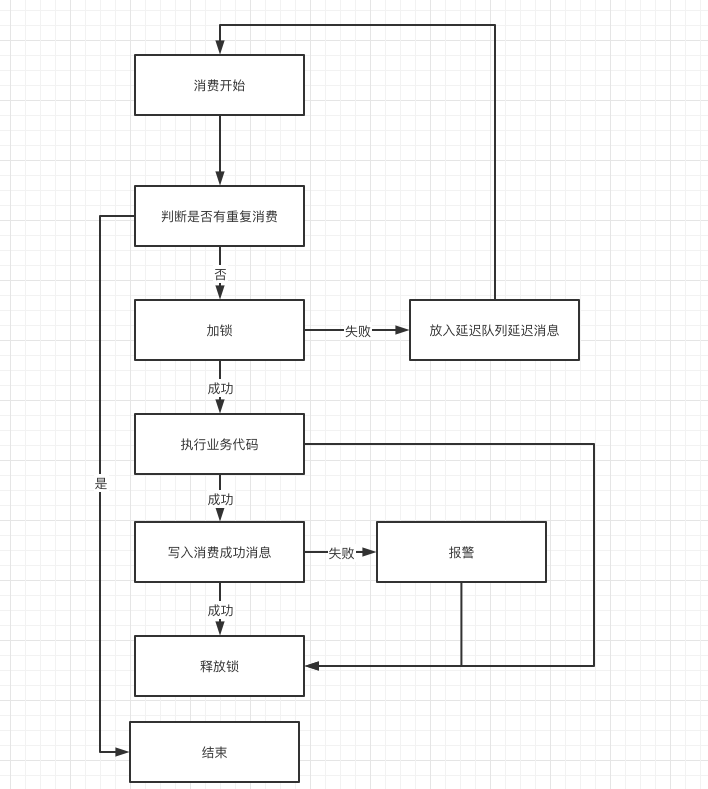

## wh-mq-Idempotent

通用的mq消息幂等去重框架，开箱即用

1. 需要项目是Springboot项目
2. 原理很简单基于Spring AOP + Redis做的
3. 现在暂时只支持Aliyun Client
4. 由于目前源代码非常轻量，所以不引用jar直接copy源代码到项目中使用也是可以的


## 使用

####
必要条件
1. redis
2. springboot
3. jdk8+

#### 1. 添加依赖
##### rocketmq-client
- maven
```xml
<dependency>
  <groupId>io.github.weihubeats</groupId>
  <artifactId>wh-mq-rocketmq</artifactId>
  <version>1.0.5</version>
</dependency>
```
- gradle
```xml
implementation 'io.github.weihubeats:wh-mq-rocketmq:1.0.5'
```

##### aliyun ons-client
```xml
<dependency>
<groupId>io.github.weihubeats</groupId>
<artifactId>wh-mq-aliyun-rocketmq</artifactId>
<version>1.0.5</version>
</dependency>
```

- gradle
```xml
implementation 'io.github.weihubeats:wh-mq-aliyun-rocketmq'
```
## 例子参考
使用例子请参考 wh-mq-Idempotent-samples 模块

springboot 使用

## 模块说明
- wh-core 核心实现
- wh-mq-rocketmq rocketmq幂等核心实现
- wh-mq-aliyun-rocketmq 阿里云client幂等核心实现
- wh-mq-Idempotent-samples 使用例子

## 设计思路



目前redis实现的大致思路如下
1. 消费者获取到MQ消费信息
2. 基于配置的MQ消息中的业务唯一键去reids(Mysql) 判断是否已消费
3. 如果没有消费则加锁防止并发问题,加锁成功则消费,失败则返回消费失败让MQ重新投递,因为这里防止第一个抢到锁的线程执行失败,所以不能直接返回成功,需要后面的任务重新投递到MQ重新消费
4. 执行业务代码成功后写入消费成功(写入redis或更新Mysql),但是需要注意的是这里有一个待优化点就是业务代码执行和写入消费成功消息不是一个原子操作,所以这里再写入消费成功信息失败后添加了报警(后续考虑优化为原子操作)
5. 释放锁

## 发布版本

- 1.0.4 : 支持阿里云RocketMQ Client
- 1.0.5 : 新增支持开源RocketMQ Client，新增自动化配置 `IdempotentConfig.java`

## 未来版本

1. 支持RabbitMQ
2. 支持kafka
3. 支持 rocketmq-spring-boot-starter 整合开箱即用

## 正在开发中。。。。。。

## 期待你的加入

作者微信:
